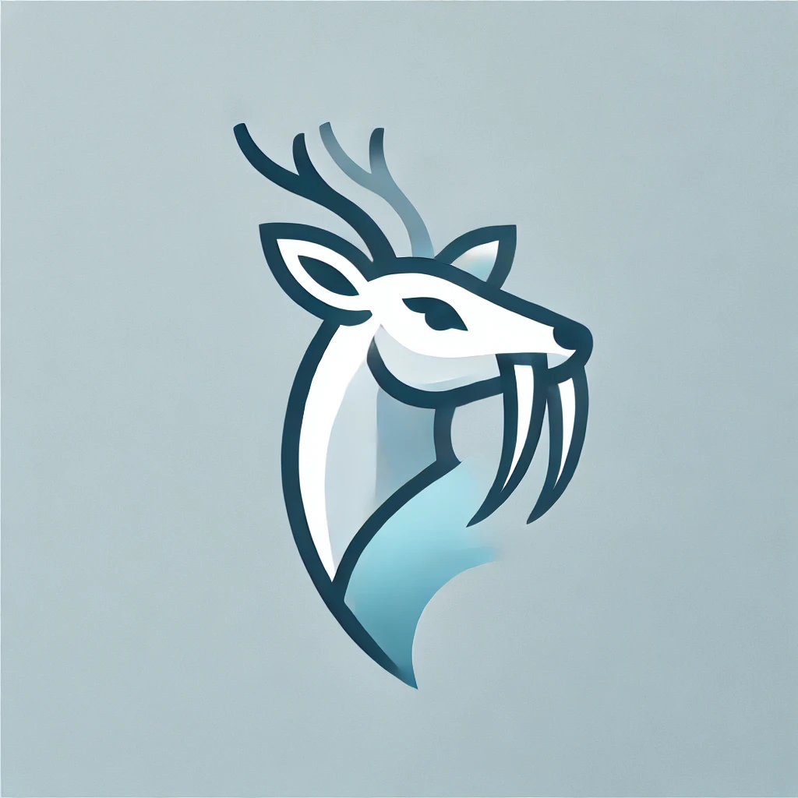

# Gorani Coder



Coding Agent/Tools to replace copilot.
# Installation

git clone <https://github.com/johnjallday/gorani-coder>

If you want to build:

```shell
cd gorani-coder
go build ./cmd/gorani-coder


```


## Requirements

Go Environment: Ensure you have Go installed.
OpenAI Account: You must have an active OpenAI account.

Obtaining Your OpenAI API Key
Sign Up or Log In:

Visit the OpenAI website and sign up for an account, or log in if you already have one.
Navigate to the API Keys Section:

Once logged in, go to your account dashboard.
Navigate to the API Keys page by clicking on your account settings or directly visit OpenAI API Keys.
Generate a New API Key:

Click the "Create new secret key" button.
Copy the generated API key immediately (this is your only chance to see the full key).
Important: Keep your API key secure. Do not share it publicly or commit it to source control.


## Roadmap

- [x] Automatic Grab features for prompting
- [] Coding Agent to automatically build and fix features in the codebase.
- [ ] GUI
- [ ] Python Support
